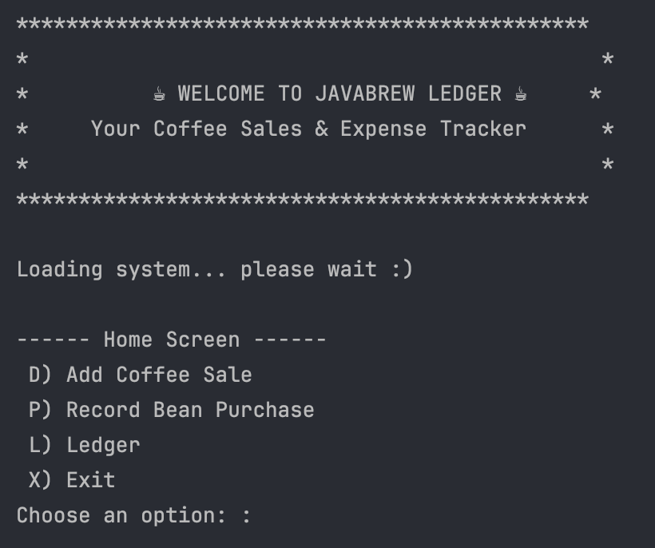
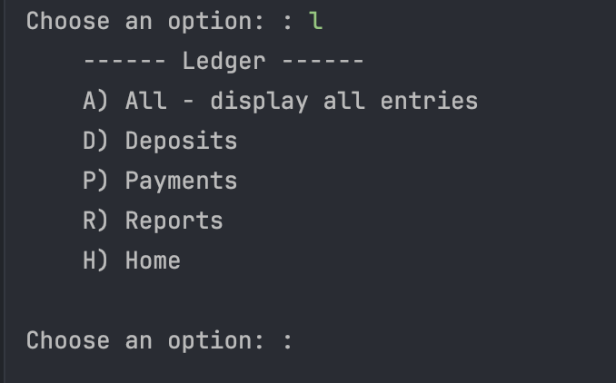
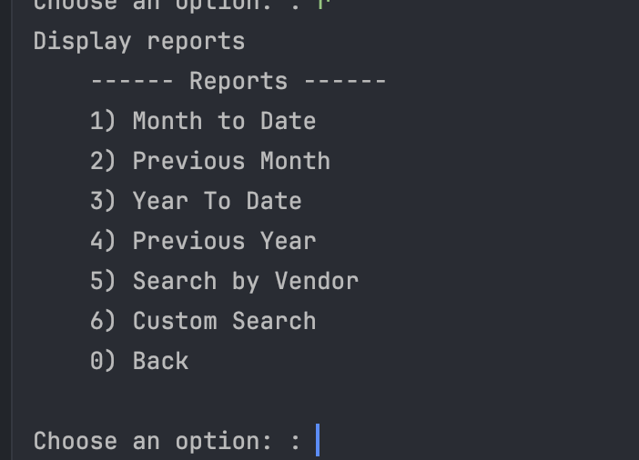
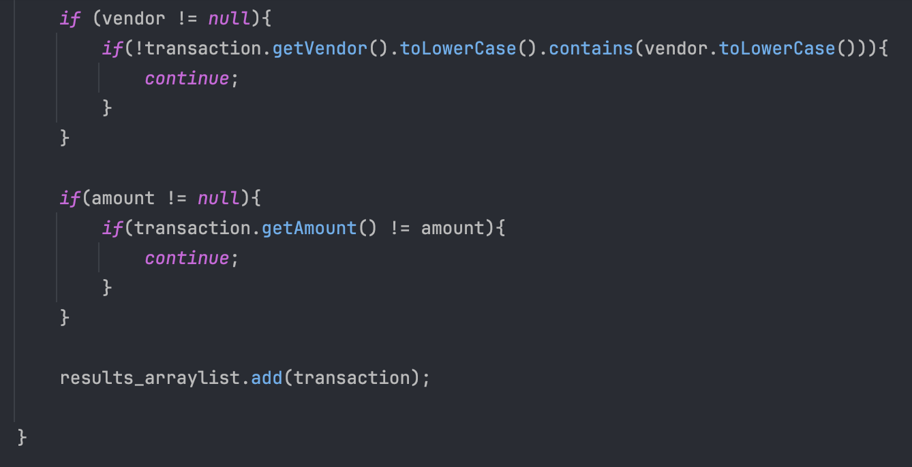
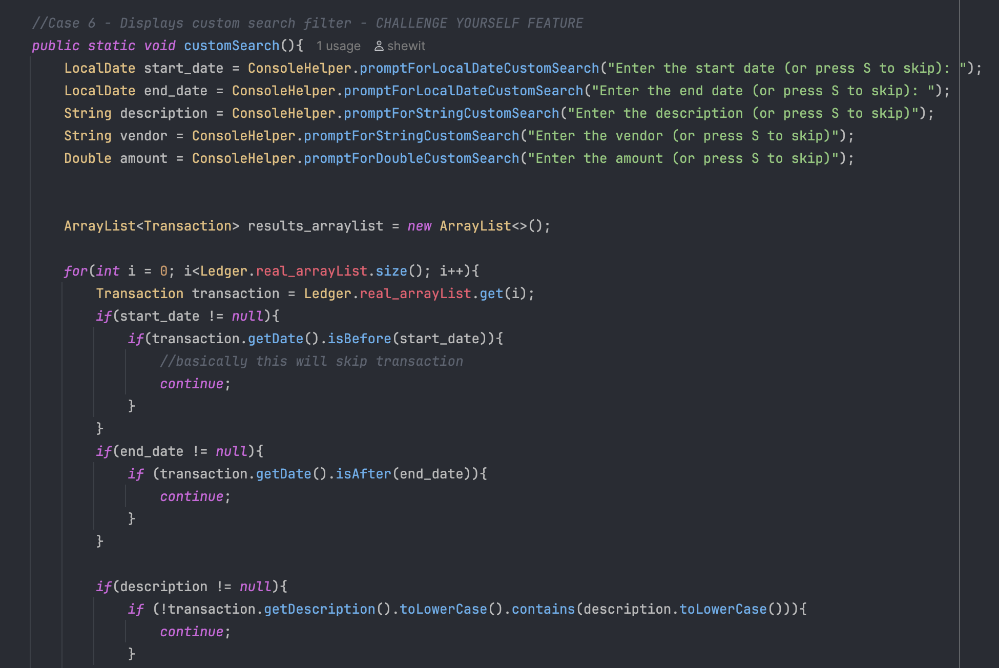

# Accounting Ledger Capstone

My name is **Shewit Hailu**, and I am a student in the **Year Up** program — a national workforce development initiative that helps young adults gain professional and technical skills.

This project is my Application Development Capstone for the Year Up program. I am **Shewit Hailu**, a **Year Up student** currently developing my skills in software engineering and application development.



**JavaBrew Ledger** a command-line interface (CLI) accounting application developed in Java that allows users to track financial transactions for a small business — in this case, a coffee shop. The program reads and writes transactions to a transactions.csv file, displaying deposits (sales), payments (purchases), and detailed financial reports.


Time spent: **2-4** days spent in total

## Required Features

The following **required** functionality is completed:

- [x] Program records user transactions (deposits and payments)
- [x] Transactions are displayed in an organized ledger format
- [x] Users can view summaries such as income, expenses, and account balance
- [x] Data is saved and retrieved using file handling

The following **optional** features are implemented:

- [x] Filter transactions by date or type
- [x] Add graphical interface (GUI) for improved user interaction

The following **additional** features are implemented:

- [x] Custom formatting for transaction reports
- [x] Enhanced error handling and input validation
- [x] Clean, modular code using object-oriented design principles

### Built With

[![Java][Java.com]][Java-url]


[![Maven][Maven.apache.org]][Maven-url]


[![IntelliJ IDEA][IntelliJ.com]][IntelliJ-url]


[![GitHub][GitHub.com]][GitHub-url]


[Java.com]: https://img.shields.io/badge/Java-ED8B00?style=for-the-badge&logo=openjdk&logoColor=white
[Java-url]: https://www.java.com/


[Maven.apache.org]: https://img.shields.io/badge/Maven-C71A36?style=for-the-badge&logo=apachemaven&logoColor=white
[Maven-url]: https://maven.apache.org/


[IntelliJ.com]: https://img.shields.io/badge/IntelliJ_IDEA-000000?style=for-the-badge&logo=intellij-idea&logoColor=white
[IntelliJ-url]: https://www.jetbrains.com/idea/


[GitHub.com]: https://img.shields.io/badge/GitHub-181717?style=for-the-badge&logo=github&logoColor=white
[GitHub-url]: https://github.com/


## 🎬 Video Walkthrough
<div>
    <a href="https://www.loom.com/share/0009564a5f944772b84eef622f7dd7b3">
      <p>Videos | Library | Loom - 15 October 2025 - Watch Video</p>
    </a>
    <a href="https://www.loom.com/share/0009564a5f944772b84eef622f7dd7b3">
      
    </a>
  </div>


## 📝 Notes

**File Handling:** Managing reading and writing transactions to a file required careful exception handling and data validation.

**Formatting Reports:** Ensuring transactions displayed in a clear, readable table format was a challenge that required string formatting and consistent spacing.

**Code Structure:** Applying object-oriented principles (classes for Transaction, Ledger, and Main) improved modularity and maintainability.


## Application Screens

### Main Dashboard - Add Deposit(Sale)/Payment(Purchase)/See Ledger


### Ledgers View - View All Deposits/Payments/See Reports


### Reports View - See Reports based on Dates/Year(s)



## Interesting Piece of Code
1. The customSearch() method is among my project's most intriguing features. With this tool, users can go through the accounting ledger's transactions using a variety of available filters, including date range, vendor, amount, and description.
2. This code demonstrates flexible and user-friendly filtering logic. Each search parameter is optional — users can press “S” to skip any filter.





## Installation

1. Clone the repo
   ```sh
   git clone https://github.com/ShewitHailu/AccountingLedger.git

2. Open the project in IntelliJ IDEA
   
3. Run Main.java
4. Follow the CLI prompts to add depoits, make payments, or view your ledger